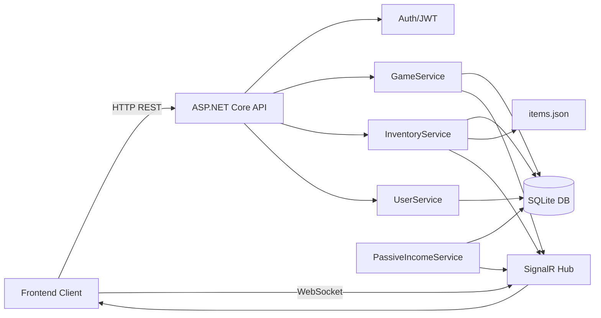

# Architecture

## Vue d'ensemble (Mermaid)

## Flux principal (resume)
- Auth: Register/Login -> JWT -> routes protegees.
- Gameplay: Click/Reset/BestScore via `GameService`.
- Inventaire: achats via `InventoryService` + `items.json`.
- Temps reel: notifications via SignalR (chat, high score, reset, score update).
